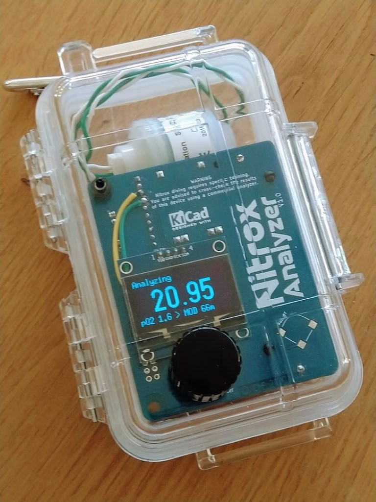

# Nitrox Analyzer
> An arduino-based oxygen analyzer for EANx/Nitrox diving gases.

[![PlatformIO][build-with-platformio]][platformio-url]
[![KiCad][made-with-kicad]][kicad-url]
![Nitrox][dive-nitrox]

 
  

<!-- TABLE OF CONTENTS -->
## Table of Contents

* [About the Project](#about-the-project)
  * [Built With](#built-with)
* [Hardware](#hardware)
* [Roadmap](#roadmap)
* [License](#license)
* [Contact](#contact)
* [Acknowledgements](#acknowledgements)

<!-- ABOUT THE PROJECT -->
## About The Project

There are many plans and schematics for Nitrox analyzers available online.
This project is an attempt to build a compact and neat device, inspired by the main characteristics of these designs, including:

* Bright OLED display
* Simple user interface using a rotary encoder
* Automatic MOD calculation for most common O2 partial pressures (1.4, 1.5 and 1.6bar)
* Automatic calibration
* Li-Ion battery, rechargeable using a micro-USB phone charger
* Sound feedback
* Custom PCB mounted for increased reliability and more polished look

### Built With

* [PlatformIO][platformio-url]
  * Arduino Framework
  * U8g2
  * ClickEncoder
  * TimerOne
* [KiCad][kicad-url]

<!-- HARDWARE -->
## Hardware

This analyzer is based on classical and cheap components, they can be sourced for <20€ (oxygen cell excluded):

| Component | Quantity | Comment |
| --- | --- | --- |
| Arduino pro mini 3.3V/8MHz | 1 | 3.3V version has been chosen for its ability to run on a single 3.7V Li-ion battery |
| ADS1115 | 1 | 16-bit ADC with PGA over I²C, using gain of 16x provides a 7.812µV resolution |
| OLED 1.3" I²C | 1 | Cheap but very readable OLED display. WARNING: depending on the model, VCC/GND pinout can be inverted |
| Rotary encoder with switch | 1 |  |
| TP4056 Battery charger | 1 | Choose the version with protection IC (has 6 connection pads) |
| 18650 Li-ion battery | 1 | Any other battery providing > 3.5V should be Ok, adjust battery monitoring divider accordingly |
| Power switch | 1 | Simple SPST should suffice |
| Passive buzzer | 1 |  |
| Resistor 100Ω | 3 |  |
| Resistor 1kΩ | 1 | For buzzer drive circuit |
| Resistor 10kΩ | 3 | For sensor load resistor and battery monitoring divider |
| NPN transistor (e.g. 2N2222) | 1 | For buzzer drive circuit |
| Connector to O2 cell | 1 | Choose the type adapted for your cell |
| O2 Cell sensor | 1 | You can use CCR cells |

Because the Pro Mini does not integrate a USB interface, you have to use a **USB to UART** breakout adapter (typically FTDI ft232) in order to program the chip. This can also be sourced for ~2€. Make sure to set the jumper on the 3.3V position.

The analyzer can be assembled by hand-wiring the components, or by soldering them on a PCB.
A detailled BOM for the PCB is available in the project `pcb` folder.

<!-- ROADMAP -->
## Roadmap

See the [open issues][issues-url] for a list of proposed features (and known issues).

<!-- LICENSE -->
## License

Copyright © 2020 Charles Fourneau

Distributed under the MIT License. See `LICENSE` for more information.

<!-- ACKNOWLEDGEMENTS -->
## Acknowledgements
* [U8g2](https://github.com/olikraus/u8g2/)
* [ClickEncoder by Dennis](https://github.com/soligen2010/encoder)
* [TimerOne](https://github.com/PaulStoffregen/TimerOne)
* [Adafruit_ADS1X15](https://github.com/adafruit/Adafruit_ADS1X15)
* and many others...

<!-- MARKDOWN LINKS & IMAGES -->
<!-- https://www.markdownguide.org/basic-syntax/#reference-style-links -->
[dive-nitrox]: https://img.shields.io/badge/Dive-Nitrox-green
[build-with-platformio]: https://img.shields.io/badge/Build%20with-PlatformIO-orange
[platformio-url]: https://platformio.org
[made-with-kicad]: https://img.shields.io/badge/Made%20with-KiCad-blue
[kicad-url]: https://www.kicad-pcb.org/
[issues-url]: https://github.com/plut0nium/Nitrox_Analyzer/issues
[license-shield]: https://img.shields.io/github/license/plut0nium/Nitrox_Analyzer.svg?style=flat-square
[license-url]: https://github.com/plut0nium/Nitrox_Analyzer/blob/master/LICENSE
